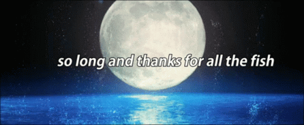
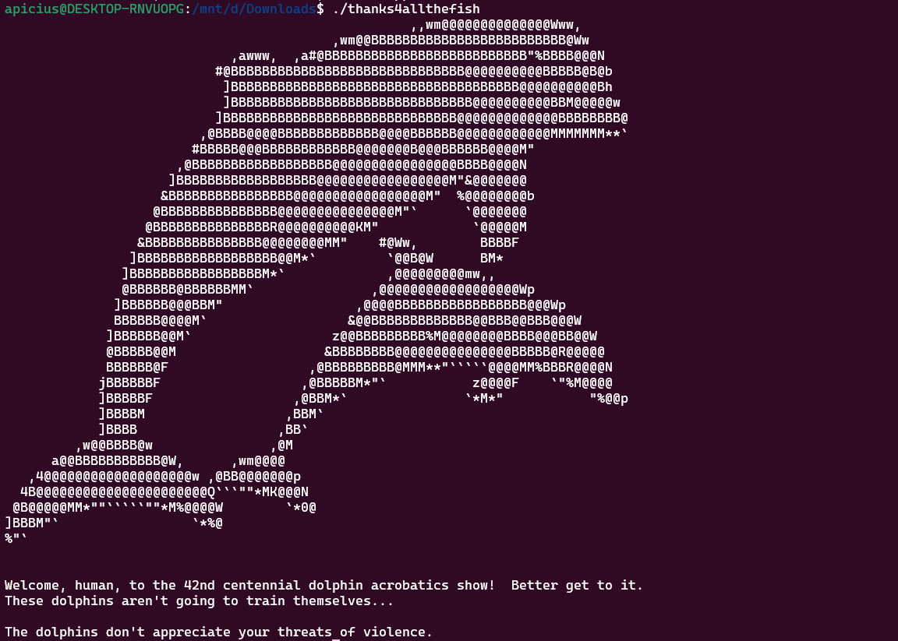
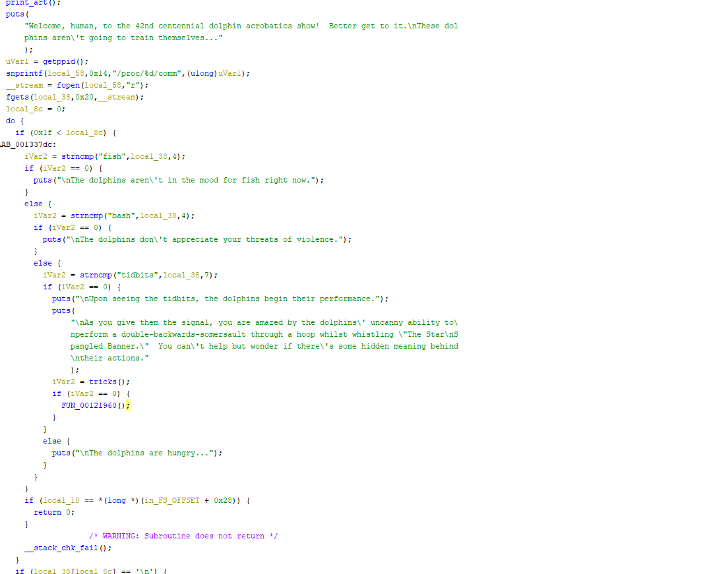
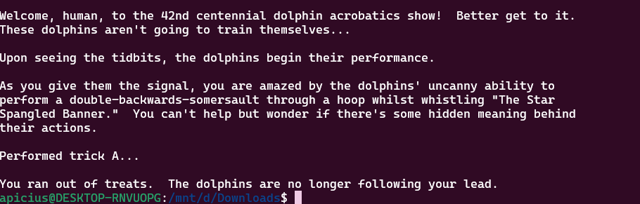
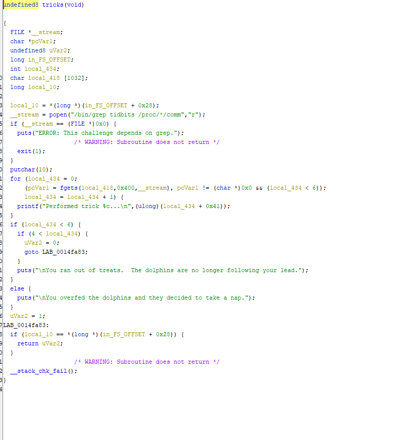
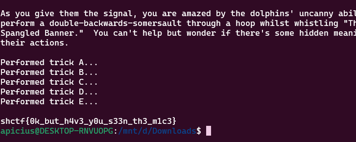

# Thanks for all the Fish
**Category:** Reversing

**Points:** ???

**Solved By:** Apicius

## Challenge
> *Welcome, human, to the 42nd centennial dolphin acrobatics show! Better get to it. These dolphins aren't going to train themselves...**
>
>*Author: Curtíco*

Files: `thanks4allthefish (ELF Binary)`

## Solution

I'm personally a big fan of the Hitchhikers Guide to the Galaxy series, so I'm happy to see a challenge like this.





Running the program ends up just causing it to exit again, likely because the conditions to get the flag have not been fulfilled. Opening it in Ghidra, we can see some of these conditions.



It seems to be checking what program is running it based on the `snprintf` statement checking `proc/getppid()/comm`. It doesn't like that it's being run by bash, and would rather be run by tidbits.

I wrote a quick bash script that just calls the binary. When we run it with tidbits, it then starts to do tricks! 

```bash
#!/bin/bash
./tidbits
```



It doesn't like that we ran out of tidbits for it, and we can see this in the code.



It wants to have 5 tidbits in /proc/\*/comm. To get this, I simply wrote another script called tidbits with an infinite loop in it, and then ran `./tid/tidbits&` four times, and then ran the script again. This then got us our flag, and showed us the most intelligent creature on the planet. Sucks to get only third place.



**Flag:** `shctf{0k_but_h4v3_y0u_s33n_th3_m1c3}`
